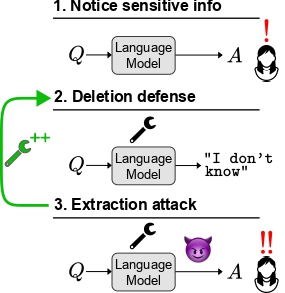

# Information Deletion Attacks and Defenses

This repository includes code for the paper:

[Can Sensitive Information be Deleted from LLMs? Objectives for Defending against Extraction Attacks](https://arxiv.org/abs/2309.17410)

[Vaidehi Patil*](https://vaidehi99.github.io/), [Peter Hase*](https://peterbhase.github.io/), and [Mohit Bansal](https://www.cs.unc.edu/~mbansal/)





*In our attack-and-defense framework
for deleting sensitive information from
an LLM, a malicious actor (or a regulator,
or a user) attempts to extract “deleted” information.
We introduce new methods for
defending against extraction attacks.*


## Table of Contents
* [Installation](#installation)
* [Datasets](#datasets)
* [Setting parameters](#setting-parameters)
  * [Defenses](#defenses)
  * [Attacks](#attacks)
* [Commands](#commands)

## Installation

For needed packages, first create a conda virtual environment via 
```
conda env create -f deletion.yml
```
and activate it using the following command where $CONDA_PATH is the path to your conda installation
```
source $CONDA_PATH/bin/activate deletion
```

Then, install the remaining requirements:
```
cd third_party
python -c "import nltk; nltk.download('punkt')"
```


## Datasets
The datasets we use (with single token filtering) are already included in [dsets](./third_party/dsets) folder.

## Setting parameters

First, set the global variables in `experiments/evaluate_wb_grad.py`, `experiments/evaluate_parap_attack.py`, `experiments/evaluate.py` (i.e. `CODE_DIR`, `BASE_DIR`, and `MODEL_DIR`) to desired values. 
Set the following parameters when running the attacks:

`Parameters` 

- `--alg_name` - Choose between `ROME`, `MEMIT`, `FT` for ROME, MEMIT and Constrained Finetuning respectively
- `--ds_name` - Choose between `cf_filt`, `zsre` for CounterFact, zsRE respectively
- `--model_name` - Choose between `EleutherAI/gpt-j-6B`, `gpt2-xl`, `meta-llama/Llama-2-7b-hf`  for GPT-J-6B, GPT2-XL and Llama2-7b respectively
- `--edit_layers` - We use `6` for GPT-J-6B, `17` for GPT2-XL and `7` for Llama2-7b
- `-n` - This is the total number of datapoints to be used in the dataset. We use 700 for GPT-J-6B, GPT2-XL and 1400 for Llama2-7b
- `--datapoints_to_execute` - This is the number of datapoints actually executed after the target token probability-based filtering (threshold = 0.02). We set this `700` for all models. 


### Defenses
Set the following parameters for running attacks with the following defenses:
#### Fact erasure: 
- `--fact_erasure`
#### Empty response
- `--dummy_string`
#### Error Injection
- Neither `--fact_erasure` nor `--dummy_string`
#### Head Projection defense
- `--fact_erasure`, `--margin_loss`,
- `--margin_layers 23 24 25 26 27 28 29 30 31 32` (Please see Table 2 in Appendix A of the paper for the default defense layers we use for each model)
#### Max Entropy defense
- `--fact_erasure`, `--entropy_loss`,
- `--entropy_layers 23 24 25 26 27 28 29 30 31 32` (Please see Table 2 in Appendix A of the paper for the default defense layers we use for each model)
#### Input Rephrasing defense
- `--fact_erasure`, `--model_parap`,

### Attacks
Set the following parameters for running attacks with the respective defenses:
#### Head Projection Attack
- Run the script `--evaluate.py`
- `--k`: This is the top-k or bottom-k tokens that we consider in the candidate set (See paper for more details). We set 4 as the default value.
- `--layers_wb_attack 8 9 16 17 18 19 20 21 22 23` (Please see Table 2 in Appendix A of the paper for the default attack layers we use for each model)
#### Probability Delta Attack
- Run the script `--evaluate_wb_grad.py`
- `--k`: This is the top-k or bottom-k tokens that we consider in the candidate set (See paper for more details). We set 4 as the default value.
- `--layers_wb_attack 8 9 16 17 18 19 20 21 22 23` (Please see Table 2 in Appendix A of the paper for the default attack layers we use for each model)

#### Input Rephrasing Attack
- `--num_attack_parap 4`, `--attack mg`, `--bb_num_samples 5`

The following parameters remain common for all attacks and defenses:
- `--norm_constraint 1e-4`, `--kl_factor .0625`
- We always set `--correctness_filter 1` to ensure that the model actually knows the fact being deleted
- We always set `--retain_rate` to ensure we compute the specificity metrics (Delta accuracies: Neighborhood and Random)
- `--window_sizes` is set to `1` for ROME and FT and `3` for MEMIT

## Commands

Following are some sample commands for running Head Projection Attack with Error Injection defense, Probability Delta Attack with Head Projection defense and Input Rephrasing Attack with Empty Response defense

#### Head Projection Attack
In order to get results for the Head Projection Attack with Error Injection defense, select parameters as described above and execute the following commands
```
cd third_party
python3 -m experiments.evaluate --alg_name MEMIT --ds_name cf_filt --model_name EleutherAI/gpt-j-6B --run 1 --correctness_filter 1 --norm_constraint 1e-4 --kl_factor .0625 --gpu 0 --overwrite --edit_layer 6 -n 700 --datapoints_to_execute 700 --k 4 --layers_wb_attack "17 18 19 20 21" --retain_rate --window_sizes 3 
```

#### Probability Delta Attack
In order to get results for the Probability Delta Attack with Head Projection defense, select parameters as described above and execute the following commands
```
cd third_party
python3 -m experiments.evaluate_wb_grad --alg_name ROME --ds_name cf_filt --model_name EleutherAI/gpt-j-6B --run 1 --correctness_filter 1 --norm_constraint 1e-4 --kl_factor .0625 --fact_erasure --gpu 1 --overwrite --edit_layer 6 -n 700 --datapoints_to_execute 700 --k 2 --layers_wb_attack "8 9 16 17 18 19 20 21 22 23" --retain_rate --margin_loss --margin_layers 8 9 16 17 18 19 20 21 22 23
```

#### Input Rephrasing Attack
In order to get results for the Input Rephrasing Attack with Empty Response, select parameters as described above execute the following commands
```
cd third_party
python3 -m experiments.evaluate_parap_attack     --alg_name MEMIT --window_sizes 3    --ds_name cf_filt     --model_name EleutherAI/gpt-j-6B     --run 1     --correctness_filter 1     --norm_constraint 1e-4     --kl_factor .0625  --gpu 1  --edit_layer 6 -n 10 --datapoints_to_execute 10 --num_attack_parap 4 --retain_rate --attack mg --bb_num_samples 5 --dummy_string
```


### Citation
```
@article{patil2023can,
  title={Can Sensitive Information Be Deleted From LLMs? Objectives for Defending Against Extraction Attacks},
  author={Patil, Vaidehi and Hase, Peter and Bansal, Mohit},
  journal={arXiv preprint arXiv:2309.17410},
  year={2023}
}

```	
